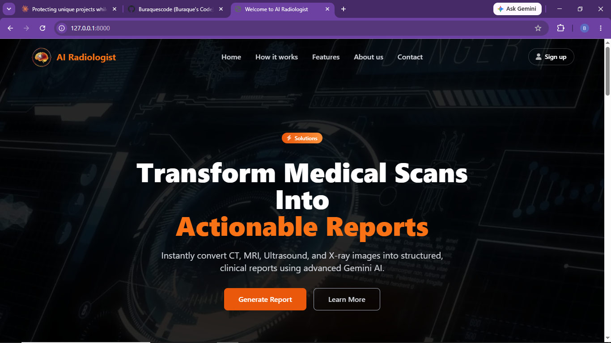
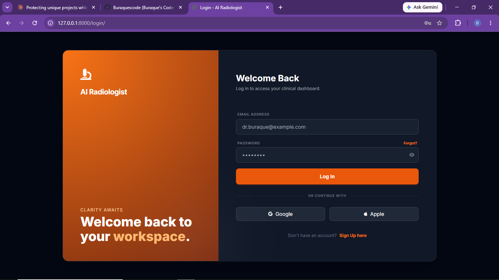
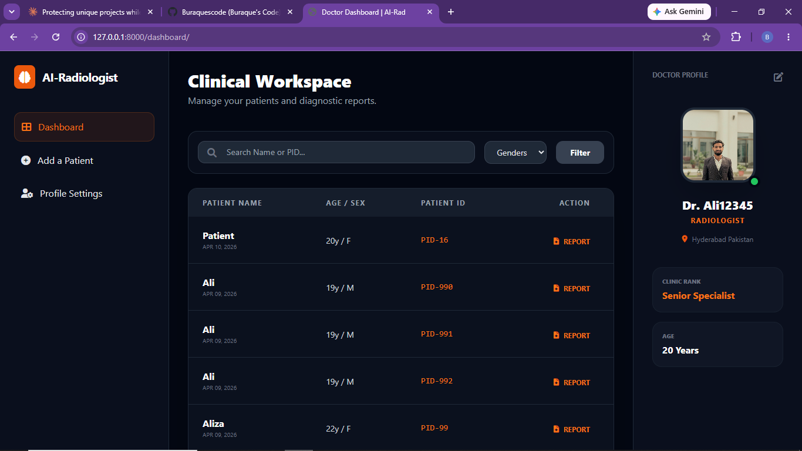
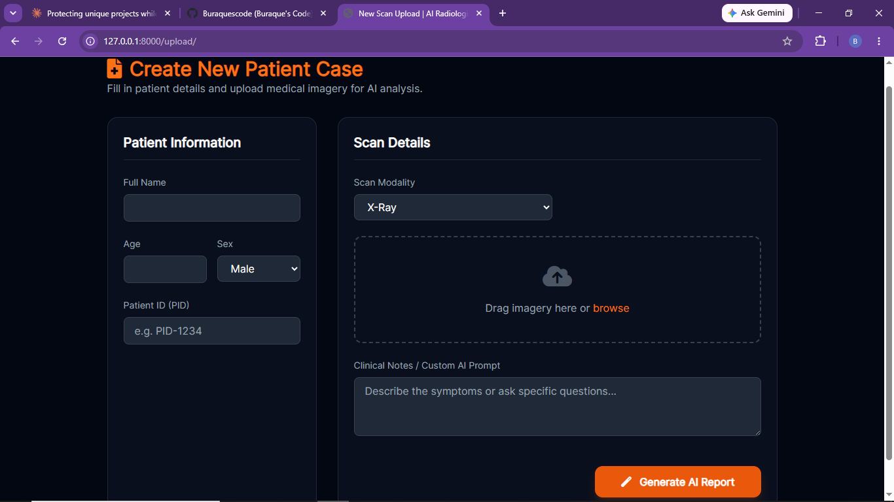
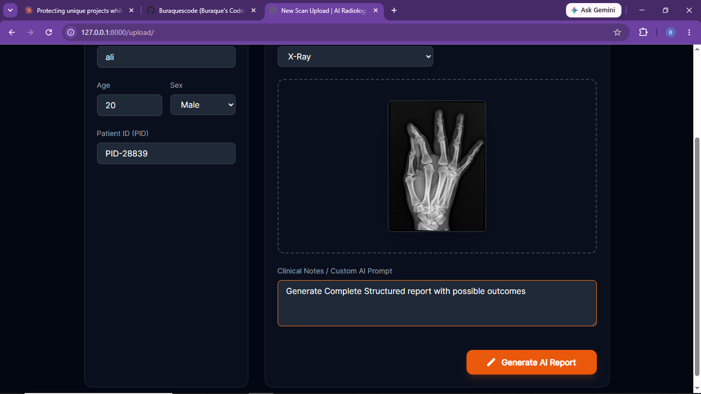
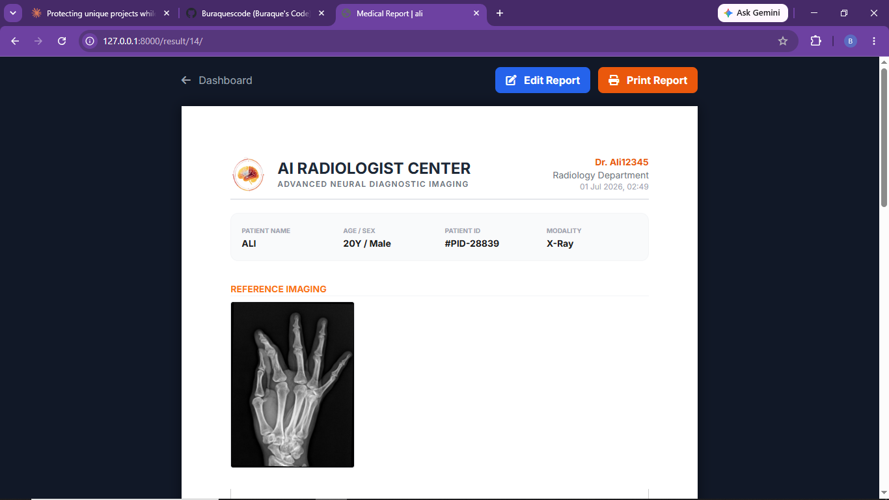
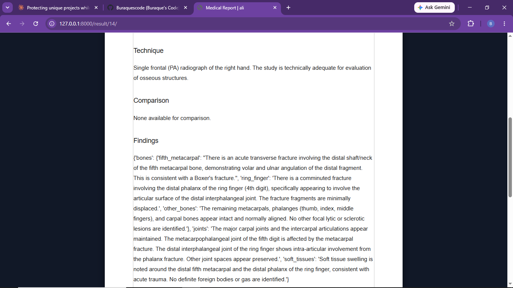
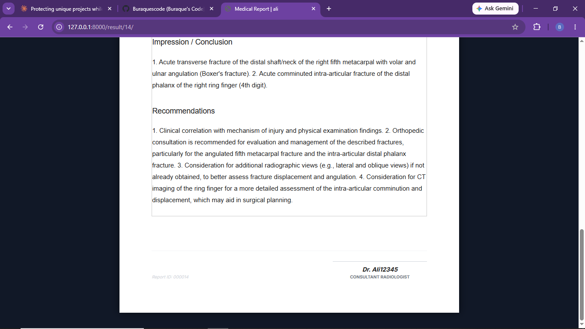

# AI Radiologist 🩻
### Reaching Clinical Consensus Using Structured Deep Learning

A hybrid Clinical Decision Support System (CDSS) that combines Convolutional Neural Networks (CNNs) with Retrieval-Augmented Generation (RAG) to generate structured, clinically-grounded diagnostic reports from medical imaging — built as a secure, production-ready Django web application.

This work is published in the **International Journal of Innovations in Science & Technology (IJIST)**, Vol. 7, Issue 10, November 2025.

> **Citation:** Syed, B., Memon, A., Haseeb, M., Bhatti, R., Lakho, S. "AI Radiologist: Reaching Clinical Consensus Using Structured Deep Learning." *IJIST*, Vol. 7, Issue 10, pp. 44–54, November 2025.

> ⚠️ This is a **showcase repository**. It presents the published research, results, and interface screenshots. The underlying model weights, RAG prompt engineering, and encryption implementation are proprietary and excluded from public release, as this system is also being developed toward commercial deployment.

---

## 🎯 The Problem

Radiologists face a growing volume of unstructured imaging data (CT, MRI, X-ray, ultrasound) with reporting that is often inconsistent across institutions. Standard deep learning models help with classification, but come with three core limitations: they're a "black box" with no clinical interpretation, they struggle with rare/out-of-distribution cases, and generative models can hallucinate — producing confident but false findings, which is unacceptable in a medical context.

## 🧠 The Approach

AI Radiologist addresses this with a hybrid architecture:

1. **Data Collection** — ~70,000 labeled medical images (CT, MRI, X-ray, ultrasound) sourced from open datasets, covering brain, heart, chest, bone, lung, COVID-19, tuberculosis, and viral pneumonia cases.
2. **CNN Feature Extraction** — A convolutional neural network trained for classification and lesion/pattern detection across modalities.
3. **Semantic Search via RAG** — Image features and diagnostic reports are stored in **ChromaDB** (vector database), creating an "institutional memory." When a new scan is uploaded, the system retrieves the top-k most similar historical cases.
4. **LLM-Guided Report Generation** — Retrieved cases are used as grounding context for a large language model, producing structured, clinically-worded reports while significantly reducing hallucination risk.
5. **Secure Django Web Application** — The full pipeline is deployed as a Model-View-Template (MVT) Django app with Role-Based Access Control (RBAC), ensuring only verified practitioners can access patient images and reports.

## 📊 Results

The proposed CNN-RAG hybrid was benchmarked against standard baseline architectures:

| Model | Accuracy | Precision | Recall | F1-Score |
|---|---|---|---|---|
| Standard CNN (Baseline) | 88.2% | 87.5% | 86.9% | 87.2% |
| VGG16 | 90.1% | 89.4% | 88.8% | 89.1% |
| ResNet-50 | 91.5% | 90.8% | 90.2% | 90.5% |
| **Proposed CNN-RAG Hybrid** | **94.5%** | **93.8%** | **94.1%** | **93.9%** |

**Performance across imaging modalities** (17,500 samples tested per modality):

| Modality | Accuracy | Precision | Recall |
|---|---|---|---|
| CT Scan | 95.2% | 94.8% | 95.0% |
| MRI | 93.8% | 92.5% | 93.1% |
| X-Ray | 96.1% | 95.5% | 95.9% |
| Ultrasound | 92.9% | 91.8% | 92.4% |

The hybrid model maintained an F1-score above 92% across all modalities, with the RAG component directly credited for anchoring the LLM's output in verified historical clinical data.

## 🩺 Validated Case Studies

The paper's qualitative evaluation covered six real-world case types, each demonstrating the system's report-generation capability:

- **Musculoskeletal (Hand X-Ray)** — Correctly localized and classified a comminuted, displaced proximal phalanx fracture with actionable clinical recommendations
- **Cardiovascular (Echocardiogram)** — Identified Doppler waveform patterns indicating possible valvular stenosis or regurgitation, correctly avoiding an overconfident absolute diagnosis
- **Neurological (Brain MRI)** — Generated a differential diagnosis (meningioma vs. dural metastasis) based on a dural tail sign, with WHO-grade prognosis reasoning
- **Pediatric (Chest X-Ray)** — Distinguished pediatric-specific diagnostic criteria (hyperinflation, cardiomegaly) from adult presentation
- **Breast MRI** — Applied oncology screening reasoning across post-contrast sequences

## 🖥️ Interface

  
  
  

  
  

  
  
  

*Sample report generated for a hand X-ray case — the system detects the fracture, classifies it, and produces a structured clinical impression with recommendations, alongside a reported accuracy and processing speed for the given scan.*

## 🛠️ Tech Stack

- **Backend:** Django (Model-View-Template architecture)
- **Deep Learning:** CNN (trained on ~70,000 multi-modal medical images)
- **Vector Database:** ChromaDB (semantic search / institutional memory)
- **LLM:** Retrieval-Augmented Generation pipeline for report synthesis
- **Security:** Role-Based Access Control (RBAC), encrypted patient data handling

## 📄 Full Paper

The complete peer-reviewed paper — including full methodology, dataset details, and all six case studies — is published open access:

**IJIST, Vol. 7, Issue 10, pp. 44–54, November 2025**
Licensed under CC BY 4.0.

## 👤 Authors

Buraque Syed¹, Aliza Memon¹, Muhammad Haseeb², Rabail Bhatti³, Shamshad Lakho²
¹Computer Science, QUEST Nawabshah, Hyderabad, Pakistan
²Computer Science, QUEST Nawabshah, Pakistan
³Information Technology, QUEST Nawabshah, Pakistan

Built and maintained by **Buraque** — Founder, CEO @ Youngdev Interns.
Full profile: [github.com/Buraquescode](https://github.com/Buraquescode)
